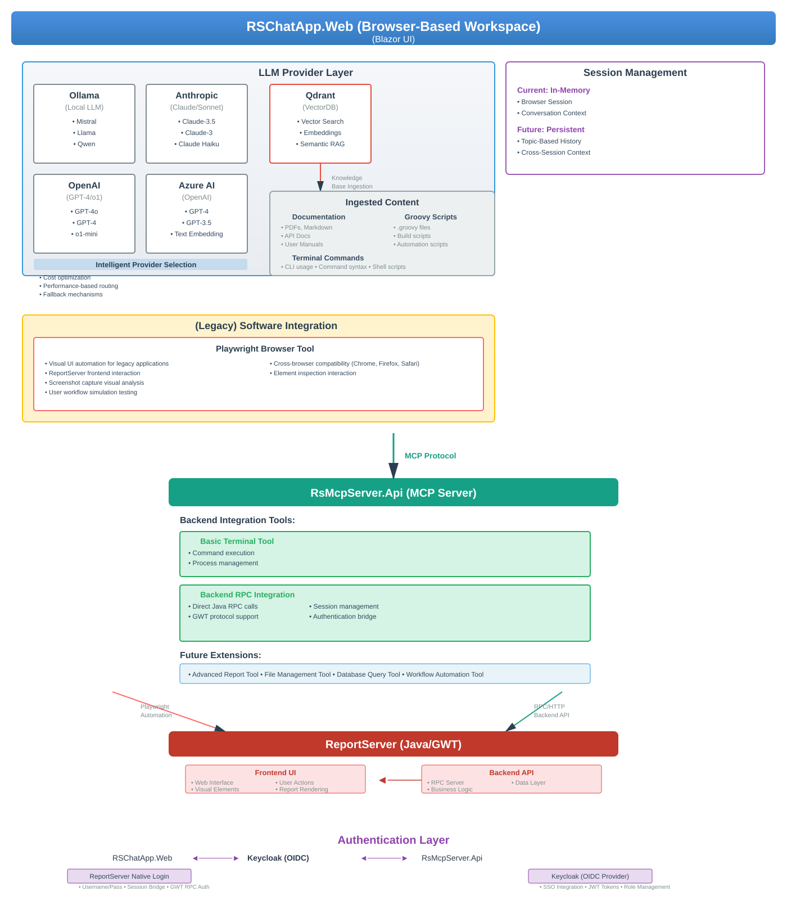

# Enterprise MCP Server for ReportServer Integration

A sophisticated **Model Context Protocol (MCP)** server implementation that provides AI-powered integration via front and backend with Java-based ReportServer application. Built with .NET 9.0, this system leverages Microsoft's latest technologies for cloud-native application development.

## 🏗️ Architecture Overview



### 📖 Architecture Description

The RSChatApp operates as a **browser-based workspace** that provides an intelligent chat interface powered by AI and enhanced with semantic search capabilities and :

**🌐 Browser-Based Workspace (RSChatApp.Web)**
- **Session Management**: Currently maintains conversation context in browser memory for immediate responsiveness
- **Interactive Chat Interface**: Real-time Blazor UI for seamless user interaction with AI models
- **Future Evolution**: Plans for persistent sessions with topic-based conversation history and cross-session context retention

**🧠 Knowledge Base Integration**
The system ingests diverse content types into Qdrant vector database for intelligent retrieval:
- **📚 Documentation**: PDFs, Markdown files, API documentation, and user manuals
- **🔧 Groovy Scripts**: Build scripts, automation scripts, and custom .groovy files  
- **💻 Terminal Commands**: CLI usage examples, command syntax references, and shell scripts

**🤖 Multi-Provider AI Intelligence**
  - **Flexible LLM Provider Layer**: Support for multiple AI providers, in future with intelligent routing and fallback 
  - **Ollama**: Local deployment for privacy-sensitive workloads and offline operation
  - **Anthropic Claude**: High-quality reasoning and code analysis with Claude-3.5 Sonnet
  - **OpenAI GPT**: Versatile models including GPT-4o and o1-mini for different use cases
  - **Azure OpenAI**: Enterprise-grade hosted OpenAI models with additional security

- **Ollama/Qdrant**: Powerful local embedding Model, provides vector search, embeddings, and semantic RAG capabilities for context-aware responses

**🤖 AI Chat Application with Legacy Software Integration (RSChatApp.Web)**
The chat application provides an **innovative AI interface for legacy software integration**:

- **🌐 Frontend Integration via Playwright Browser Tool**:
  - **Visual UI Automation**: AI-powered browser automation for legacy applications like ReportServer
  - **Screenshot Analysis**: AI can capture and analyze visual interfaces to understand application state
  - **User Workflow Simulation**: Automate complex user interactions through natural language commands
  - **Cross-Browser Compatibility**: Support for Chromium, Firefox, and WebKit browsers
  - **Element Inspection**: AI can identify and interact with web elements dynamically

**🔧 MCP Server Backend Integration (RsMcpServer.Web)**
The MCP server provides **backend integration capabilities** for ReportServer:

- **⚙️ Backend Integration (RPC Client)**:
  - **Direct Java RPC Communication**: Low-level API access for programmatic operations
  - **GWT Protocol Support**: Native communication with ReportServer's GWT backend
  - **Session Management**: Efficient authentication and session handling
  - **High-Performance Operations**: Bulk data operations and system administration

- **🔄 Dual Integration Strategy**: AI agents can leverage both frontend and backend approaches:
  - **Frontend Tasks**: Use Playwright in the chat app for visual verification and user workflow testing
  - **Backend Tasks**: Use RPC via MCP server for bulk operations and system configuration
  - **Hybrid Workflows**: Combine both approaches for comprehensive automation scenarios

**🔐 Dual Authentication Support**
The system supports both modern and legacy authentication methods:

- **🆕 Modern Keycloak OIDC**: Enterprise-grade authentication with SSO, JWT tokens, and role management
- **🔧 Legacy ReportServer Authentication**: Direct username/password authentication with GWT RPC session bridging
- **🔄 Flexible Authentication Mode**: AI agents can authenticate using the most appropriate method based on deployment configuration

## 🚀 Key Features

### **Enterprise Authentication & Security**
- ✅ **Dual Authentication Support**: Both modern Keycloak OIDC and legacy ReportServer authentication
- ✅ **Centralized Keycloak OIDC Authentication** with PKCE support
- ✅ **Legacy GWT RPC Authentication** for existing ReportServer deployments
- ✅ **Seamless ReportServer Integration** through session bridging
- ✅ **JWT Token Management** with automatic refresh
- ✅ **Cross-System Session Synchronization**
- ✅ **Role-Based Access Control (RBAC)**

### **Multi-Provider AI Chat Interface**
- ✅ **Modern Blazor Web UI** with real-time chat capabilities
- ✅ **Multiple LLM Provider Support**:
  - **Ollama Integration** for local LLM inference (Mistral, Llama, Qwen)
  - **Anthropic Claude** for advanced reasoning (Claude-3.5 Sonnet, Claude-3, Haiku)
  - **OpenAI GPT** for versatile AI capabilities (GPT-4o, GPT-4, o1-mini)
  - **Azure OpenAI** for enterprise-grade hosted models
- ✅ **Qdrant Vector Database** for semantic search and RAG
- ✅ **Document Ingestion Pipeline** with PDF support
- ✅ **Semantic Search** across ingested documents

### **AI-Powered Legacy Software Integration**
- ✅ **Frontend Integration via Chat App Playwright Tool**:
  - **Visual UI Automation** integrated directly into the AI chat interface
  - **Natural Language Interface** for legacy application interaction
  - **Screenshot Analysis** and visual feedback within chat
  - **Cross-Browser Support** (Chromium, Firefox, WebKit)
  - **Element Inspection** and dynamic interaction capabilities
- ✅ **Backend Integration via MCP Server RPC Client**:
  - **Direct Java RPC Communication** for programmatic operations
  - **GWT Protocol Support** for native ReportServer API access
  - **High-Performance Bulk Operations** and system administration
  - **Session Management** with authentication bridging
- ✅ **Hybrid AI Workflows** combining both approaches for comprehensive automation

### **MCP Server Integration**
- ✅ **Microsoft Extensions AI Framework** for MCP protocol
- ✅ **Direct ReportServer RPC Client** for Java interoperability
- ✅ **Playwright Browser Automation** for UI testing and interaction
- ✅ **Tool Integration** for AI agent functionality
- ✅ **Terminal Operations** support for ReportServer CLI
- ✅ **HTTP & SSE Transport** protocols

### **Cloud-Native Deployment**
- ✅ **.NET Aspire Orchestration** for microservices
- ✅ **Docker Containerization** with persistent volumes
- ✅ **Health Checks & Monitoring** with OpenTelemetry
- ✅ **Service Discovery** and load balancing
- ✅ **Configuration Management** with environment-specific settings

## 🚀 Quick Start

### **1. Using .NET Aspire (Recommended)**

Start the entire application stack with one command:

```bash
# Navigate to the Aspire host directory
cd RSChatApp.AppHost

# Start all services (Ollama with auto-downloaded models, Qdrant, MCP Server, Web App)
dotnet run
```

**💡 Windows Users Note:** If you're using Windows with Docker Desktop, you may need to set up a PowerShell alias for Docker Compose. The Aspire orchestration API uses the legacy `docker-compose` syntax. Run this command in PowerShell as Administrator:

```powershell
Set-Alias -Name docker-compose -Value 'docker compose'
```

This will automatically:
- ✅ Start **Ollama** in Docker with GPU support (if available) as the default local LLM provider
- ✅ Pull and configure required AI models automatically (configurable in appsettings.json)
- ✅ Set up **multiple LLM provider support** (configure Anthropic, OpenAI, Azure OpenAI in appsettings.json)
- ✅ Start **Qdrant** vector database in Docker with persistent storage
- ✅ Launch the **MCP Server** with authentication
- ✅ Start the **Blazor Web Application** with intelligent LLM provider selection
- ✅ Open the **Aspire Dashboard** for monitoring

**Access Points:**
- 📱 **Chat Application**: `http://localhost:5123` (or as shown in Aspire dashboard)
- 🔧 **Aspire Dashboard**: `http://localhost:15986`
- 🤖 **MCP Server API**: `http://localhost:5002`
- 📊 **Qdrant Dashboard**: `http://localhost:6333/dashboard`

**Note:** The first run may take a few minutes as Docker images are downloaded and AI models are pulled automatically. To use commercial LLM providers (Anthropic, OpenAI, Azure), configure your API keys as Env variables and configure its name in appsettings.json file.

## Core Components

### 🚀 MCP Server with ReportServer Integration

- **RsMcpServerSDK.Web/**: Modern MCP server using Microsoft Extensions AI framework
- **RSChatApp.Web/**: Interactive Blazor web client with chat UI
- **ReportServerRPCClient/**: Direct RPC client for Java ReportServer integration
- **RSChatApp.AppHost/**: .NET Aspire orchestration for cloud-native deployment

#### Key Features
- ✅ Uses official Microsoft Extensions AI SDK
- ✅ Full .NET 9.0 integration with Aspire orchestration
- ✅ Direct ReportServer RPC integration
- ✅ Comprehensive logging and error handling

## Project Structure

### Modern MCP Server Implementation with .NET Aspire

- **RSChatApp.AppHost/**: .NET Aspire app host that orchestrates all components
  - **Program.cs**: Configures and links Ollama, Qdrant, MCP Server, and Web App
  - **appsettings.json**: Configuration settings

- **RsMcpServerSDK.Web/**: Modern MCP server implementation
  - **Program.cs**: Entry point with Microsoft.Extensions.AI MCP server configuration
  - **Services/McpReportServer.cs**: MCP server with decorated functions
  - **Models/**: Data models for MCP responses

- **RSChatApp.Web/**: Interactive chat web application
  - **Program.cs**: Web app configuration with AI client setup
  - **Components/**: Blazor UI components
  - **Services/**: AI chat services, vector search, and data ingestion

- **ReportServerRPCClient/**: Direct RPC client for Java ReportServer
  - **Services/**: Implementation of RPC client
  - **DTOs/**: Data transfer objects for RPC communication

- **ReportServer.Abstraction/**: Interface definitions for Report Server communication
  - **IReportServerClient.cs**: Main interface for communicating with ReportServer
  - **Contracts/**: Data contracts for the ReportServer API

## Prerequisites

- .NET 9.0 SDK or later
- Docker Desktop (for all containerized services)
- Java JDK 17 or later (for ReportServer - if running locally)
- Keycloak 22+ (for authentication - can be run via Docker)

**Note:** Ollama, Qdrant, and AI models are automatically managed by the .NET Aspire AppHost via Docker containers - no manual installation required!

## Getting Started

### Starting the Application with Aspire

1. Ensure you have Docker running on your system

2. Navigate to the RSChatApp.AppHost directory:

```bash
cd RSChatApp.AppHost
```

3. Run the application:

```bash
dotnet run
```

This will start all required services in the correct order:
- Ollama (with specified models)
- Qdrant vector database
- RsMcpServerSDK.Web MCP server
- RSChatApp.Web Blazor web application

4. Open the Aspire dashboard at the provided URL (typically http://localhost:15986) to monitor all services

5. Access the chat web interface at the URL shown in the dashboard (typically http://localhost:5123)

### Testing the MCP Server

You can test the MCP server functionality using the provided test script:

```bash
chmod +x test-mcp-server.sh
./test-mcp-server.sh
```

Or test directly using the Aspire dashboard to monitor service health and interactions.

## ⚙️ Configuration


#### **RSChatApp.Web Configuration**

```json
{
  "Logging": {
    "LogLevel": {
      "Default": "Information",
      "Microsoft.AspNetCore": "Warning",
      "Microsoft.EntityFrameworkCore": "Warning",
      "RSChatApp.ServiceDefaults.Authentication": "Information"
    }
  },
  "AllowedHosts": "*",

  "ReportServer": {
    "Address": "http://localhost:8081",
    "SessionTimeout": "01:00:00",
    "CookieDomain": "localhost",
    "EnableSessionBridge": true
  },
  "LLMProviders": {
    "DefaultProvider": "Ollama",
    "FallbackStrategy": "Cascade",
    "Ollama": {
      "Address": "http://0.0.0.0:11434",
      "Model": "mistral-nemo:12b",
      "EmbeddingModel": "llama3.2:1b",
      "MaxTokens": 4096,
      "Temperature": 0.7,
      "Enabled": true
    },
    "Anthropic": {
      "ApiKey": "Env",
      "Model": "claude-3-5-sonnet-20241022",
      "MaxTokens": 4096,
      "Temperature": 0.7,
      "Enabled": false
    },
    "OpenAI": {
      "ApiKey": "your-openai-api-key",
      "Model": "gpt-4o",
      "MaxTokens": 4096,
      "Temperature": 0.7,
      "Enabled": false
    },
    "AzureOpenAI": {
      "Endpoint": "https://your-resource.openai.azure.com/",
      "ApiKey": "your-azure-openai-key",
      "DeploymentName": "gpt-4",
      "MaxTokens": 4096,
      "Temperature": 0.7,
      "Enabled": false
    }
  },
  "Qdrant": {
    "Address": "http://localhost:6334"
  },
  "RsMcpServer": {
    "Address": "http://localhost:5002"
  }
}
```

#### **RsMcpServer.Web Configuration**

```json
{
  "Logging": {
    "LogLevel": {
      "Default": "Information",
      "Microsoft": "Warning",
      "Microsoft.Hosting.Lifetime": "Information",
      "RSChatApp.ServiceDefaults.Authentication": "Information"
    }
  },
  "Keycloak": {
    "Authority": "http://localhost:8080/realms/reportserver",
    "ClientId": "reportserver-app",
    "ClientSecret": "your-client-secret-here",
    "Realm": "reportserver",
    "Scopes": [
      "openid",
      "profile",
      "email",
      "roles"
    ],
    "RequireHttpsMetadata": false,
    "TokenRefreshThreshold": "00:05:00"
  },
  "ReportServer": {
    "Address": "http://localhost:8081/",
    "SessionTimeout": "01:00:00",
    "CookieDomain": "localhost"
  }
}
```

#### **Configuration Parameters Explained**

**Keycloak Settings:**
- `Authority`: Keycloak realm URL
- `ClientId`: Client identifier in Keycloak
- `ClientSecret`: Client secret (get from Keycloak admin console)
- `Realm`: Keycloak realm name
- `Scopes`: OpenID Connect scopes to request
- `RequireHttpsMetadata`: Set to `false` for development, `true` for production
- `TokenRefreshThreshold`: Time before token expiry to refresh

**ReportServer Settings:**
- `Address`: ReportServer base URL
- `SessionTimeout`: Session timeout duration
- `CookieDomain`: Domain for session cookies
- `EnableSessionBridge`: Enable session bridging between Keycloak and ReportServer

**LLM Provider Settings:**
- `DefaultProvider`: Primary LLM provider to use ("Ollama", "Anthropic", "OpenAI", "AzureOpenAI")
- `FallbackStrategy`: How to handle provider failures ("Cascade", "RoundRobin", "None")

**Ollama Settings:**
- `Address`: Ollama server URL
- `Model`: Chat completion model (e.g., "mistral-nemo:12b", "llama3.2:3b")
- `EmbeddingModel`: Text embedding model
- `Enabled`: Whether this provider is available

**Anthropic Claude Settings:**
- `ApiKey`: Anthropic API key from console.anthropic.com
- `Model`: Claude model variant ("claude-3-5-sonnet-20241022", "claude-3-haiku-20240307")
- `Enabled`: Whether this provider is available

**OpenAI Settings:**
- `ApiKey`: OpenAI API key from platform.openai.com
- `Model`: GPT model variant ("gpt-4o", "gpt-4", "o1-mini")
- `Enabled`: Whether this provider is available

**Azure OpenAI Settings:**
- `Endpoint`: Azure OpenAI resource endpoint
- `ApiKey`: Azure OpenAI API key
- `DeploymentName`: Deployment name in Azure (not the model name)
- `Enabled`: Whether this provider is available

**Qdrant Settings:**
- `Address`: Qdrant vector database URL

#### **Environment-Specific Configuration**

**Development Environment:**
```json
{
  "Keycloak": {
    "RequireHttpsMetadata": false,
    "Authority": "http://localhost:8080/realms/reportserver"
  },
  "ReportServer": {
    "Address": "http://localhost:8081"
  }
}
```

**6. Start Chat Application**
```bash
cd RSChatApp.Web
dotnet run
```

**Note:** Manual setup requires you to configure all the networking and dependencies yourself. The Aspire approach handles all of this automatically with proper service discovery and health checks.
