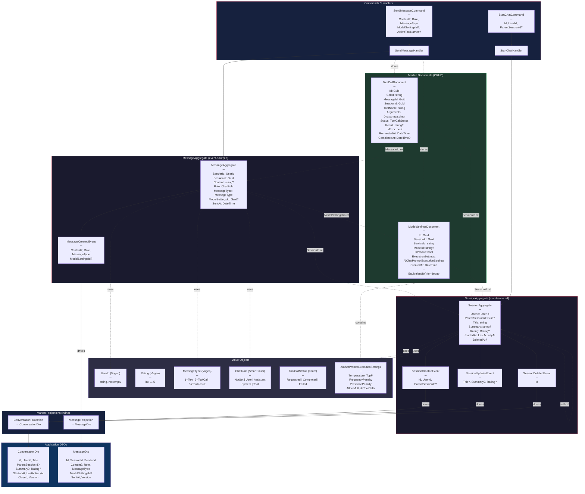

# Plan: Data Model Extension — Lean Message + Document Entities + Session Enhancements

## Overview

The domain uses **two event-sourced aggregates** (Marten event streams) and **two CRUD Marten documents** (plain PostgreSQL JSON documents), connected by `Guid` references. All primitive-wrapping types use **Vogen value objects** with validation or **SmartEnum** for type safety.

---

## Event-Sourced Aggregates

### SessionAggregate

Represents a chat conversation. Supports hierarchical sub-conversations via self-referencing `ParentSessionId`. Mutable fields (`Title`, `Summary`, `Rating`) evolve over time through `SessionUpdatedEvent`.

| Property | Type | Notes |
|----------|------|-------|
| Id | `Guid` | Stream identity |
| UserId | `UserId` | Vogen, not empty |
| ParentSessionId | `Guid?` | Self-ref for sub-conversations |
| Title | `string` | Updated via `SessionUpdatedEvent` |
| Summary | `string?` | Updated via `SessionUpdatedEvent` |
| Rating | `Rating?` | Vogen, 1–5 |
| StartedAt | `DateTime` | Immutable, set on creation |
| LastActivityAt | `DateTime` | Updated on every event |
| DeletedAt | `DateTime?` | Soft delete |

**Events:** `SessionCreatedEvent`, `SessionUpdatedEvent`, `SessionDeletedEvent`

### MessageAggregate

A single message within a session. Deliberately lean — tool call payloads and model config live in separate documents, referenced by ID. `Content` is nullable for pure tool-call messages.

| Property | Type | Notes |
|----------|------|-------|
| Id | `Guid` | Stream identity |
| SessionId | `Guid` | FK → SessionAggregate |
| SenderId | `UserId` | Vogen, not empty |
| Content | `string?` | Nullable for tool-call-only messages |
| Role | `ChatRole` | SmartEnum: User, Assistant, System, Tool |
| MessageType | `MessageType` | Vogen: Text(1), ToolCall(2), ToolResult(3) |
| ModelSettingsId | `Guid?` | FK → ModelSettingsDocument |
| SentAt | `DateTime` | Immutable |

**Events:** `MessageCreatedEvent`

---

## CRUD Marten Documents

### ModelSettingsDocument

Immutable snapshot of AI model configuration. Deduplicated per session — a new document is only created when settings change (`EquivalentTo()` comparison). Many messages share the same `ModelSettingsId`.

| Property | Type | Notes |
|----------|------|-------|
| Id | `Guid` | Document identity |
| SessionId | `Guid` | FK → SessionAggregate |
| ServiceId | `string` | e.g. `"main"`, `"helper"` |
| ModelId | `string?` | e.g. `"claude-sonnet-4-5"` |
| IsPrivate | `bool` | Privacy flag |
| ExecutionSettings | `AiChatPromptExecutionSettings?` | Temperature, TopP, FrequencyPenalty, PresencePenalty, AllowMultipleToolCalls |
| CreatedAt | `DateTime` | Snapshot timestamp |

**Indexes:** `SessionId`

### ToolCallDocument

Tracks a single tool invocation lifecycle. Created with `Status=Requested`, updated in-place to `Completed`/`Failed` with result. Linked to both the triggering message and the session.

| Property | Type | Notes |
|----------|------|-------|
| Id | `Guid` | Document identity |
| CallId | `string` | LLM-assigned call identifier |
| MessageId | `Guid` | FK → MessageAggregate |
| SessionId | `Guid` | FK → SessionAggregate |
| ToolName | `string` | e.g. `"BrowserTool"` |
| Arguments | `Dictionary<string, string>` | Caller serializes edge-case objects |
| Status | `ToolCallStatus` | Enum: Requested, Completed, Failed |
| Result | `string?` | Populated on completion |
| IsError | `bool` | Error flag |
| RequestedAt | `DateTime` | Creation timestamp |
| CompletedAt | `DateTime?` | Completion timestamp |

**Indexes:** `SessionId`, `MessageId`, `CallId`

---

## Value Objects

| Type | Kind | Validation |
|------|------|------------|
| `UserId` | Vogen `string` | Not empty |
| `Rating` | Vogen `int` | 1–5 |
| `MessageType` | Vogen `int` | 1=Text, 2=ToolCall, 3=ToolResult |
| `ChatRole` | SmartEnum `int` | NotSet(0), User(1), Assistant(2), System(3), Tool(4) |
| `ToolCallStatus` | Enum | Requested(0), Completed(1), Failed(2) |
| `AiChatPromptExecutionSettings` | Record | Temperature, TopP, FrequencyPenalty, PresencePenalty, AllowMultipleToolCalls |

---

## Relationships

```
SessionAggregate ←──(ParentSessionId)──→ SessionAggregate  (self-ref, sub-conversations)
SessionAggregate ←──(SessionId)───────── MessageAggregate
SessionAggregate ←──(SessionId)───────── ModelSettingsDocument
SessionAggregate ←──(SessionId)───────── ToolCallDocument
MessageAggregate ←──(ModelSettingsId)──→ ModelSettingsDocument
MessageAggregate ←──(MessageId)───────── ToolCallDocument
```

## Projections (inline, synchronous)

| Projection | Source Events | Target DTO |
|------------|--------------|------------|
| `ConversationProjection` | `SessionCreatedEvent`, `SessionUpdatedEvent`, `MessageCreatedEvent`, `SessionDeletedEvent` | `ConversationDto` |
| `MessageProjection` | `MessageCreatedEvent` | `MessageDto` |

---

## Commands / Handlers

### StartChatCommand → StartChatHandler

Creates a `SessionAggregate`. Accepts optional `ParentSessionId` for sub-conversations.

### SendMessageCommand → SendMessageHandler

Creates a `MessageAggregate`. Handler orchestrates: store/reuse `ModelSettingsDocument` (dedup by value equality), store `ToolCallDocument`s (Status=Requested), then create lean `MessageAggregate` with refs. On tool-result messages, update existing `ToolCallDocument`s (Status=Completed + Result).

---

## Design Decisions

1. **ModelSettings as document, not aggregate** — immutable snapshots with no state transitions. Event-sourcing would be YAGNI.
2. **ToolCallDocument as document, not aggregate** — lifecycle is simple CRUD (create → update with result). Queryable directly by `SessionId`/`MessageId`/`CallId` without projections.
3. **Content nullable** — assistant messages with only tool calls carry no text. Validation relaxed: only `ChatRole.User` requires non-empty content.
4. **MessageType as Vogen value object** — discriminates Text/ToolCall/ToolResult so consumers can filter without inspecting content.
5. **Dictionary<string, string> for Arguments** — clean Marten/PostgreSQL round-trips. No `JsonElement` parsing on queries. Caller serializes complex objects to string for edge cases.
6. **ModelSettings dedup via EquivalentTo()** — handler compares current settings against last `ModelSettingsDocument` for the session. If identical, reuses its `Id`. If different, creates a new document.
7. **ParentSessionId for sub-conversations** — self-referencing `Guid?` on `SessionAggregate`. Sub-sessions have their own message streams. Query children via `ConversationDto.ParentSessionId`.
8. **Rating as Vogen value object** — validated 1–5, type-safe throughout the stack.

## Mermaid Graph



