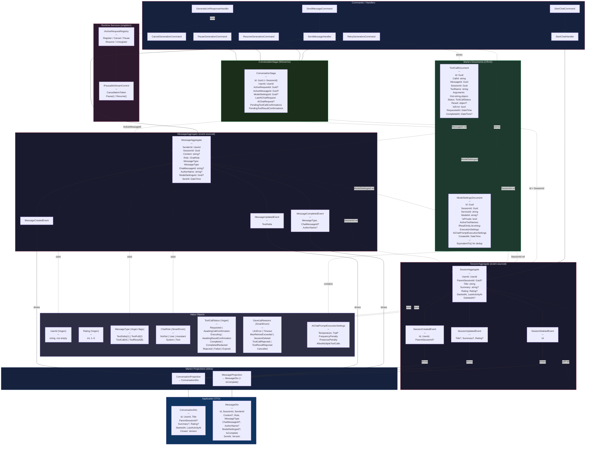
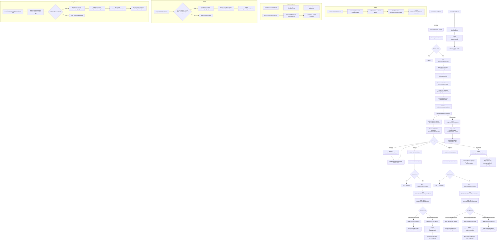

# Data Model — Lean Message + Document Entities + Session Enhancements + ConversationSaga

## Overview

The domain uses **two event-sourced aggregates** (Marten event streams) and **two CRUD Marten documents** (plain PostgreSQL JSON documents), connected by `Guid` references. A **Wolverine saga** (`ConversationSaga`) orchestrates the LLM request lifecycle including tool call confirmation, pause/resume, cancel, retry, and startup recovery. All primitive-wrapping types use **Vogen value objects** with validation or **SmartEnum** for type safety.

---

## Event-Sourced Aggregates

### SessionAggregate

Represents a chat conversation. Supports hierarchical sub-conversations via self-referencing `ParentSessionId`. Mutable fields (`Title`, `Summary`, `Rating`) evolve over time through `SessionUpdatedEvent`.

| Property | Type | Notes |
|----------|------|-------|
| Id | `Guid` | Stream identity |
| UserId | `UserId` | Vogen, not empty |
| ParentSessionId | `Guid?` | Self-ref for sub-conversations |
| Title | `string` | Updated via `SessionUpdatedEvent` |
| Summary | `string?` | Updated via `SessionUpdatedEvent` |
| Rating | `Rating?` | Vogen, 1–5 |
| StartedAt | `DateTime` | Immutable, set on creation |
| LastActivityAt | `DateTime` | Updated on every event |
| DeletedAt | `DateTime?` | Soft delete |

**Events:** `SessionCreatedEvent`, `SessionUpdatedEvent`, `SessionDeletedEvent`

### MessageAggregate

A single message within a session. Deliberately lean — tool call payloads and model config live in separate documents, referenced by ID. `Content` is nullable for pure tool-call messages. Assistant messages stream via `MessageUpdatedEvent` deltas and finalize with `MessageCompletedEvent`.

| Property | Type | Notes |
|----------|------|-------|
| Id | `Guid` | Stream identity |
| SessionId | `Guid` | FK → SessionAggregate |
| SenderId | `UserId` | Vogen, not empty |
| Content | `string?` | Nullable for tool-call-only messages; accumulated via deltas |
| Role | `ChatRole` | SmartEnum: User, Assistant, System, Tool |
| MessageType | `MessageType` | Vogen flags: TextDelta(1), TextFull(2), ToolCall(4), ToolResult(8) |
| ChatMessageId | `string?` | LLM-assigned message ID |
| AuthorName | `string?` | LLM-assigned author |
| ModelSettingsId | `Guid?` | FK → ModelSettingsDocument |
| SentAt | `DateTime` | Immutable |

**Events:** `MessageCreatedEvent`, `MessageUpdatedEvent`, `MessageCompletedEvent`

- `MessageCreatedEvent` — creates the stream. User messages are created as `TextFull`; assistant messages as `TextDelta` (incomplete).
- `MessageUpdatedEvent(string TextDelta)` — appends streaming content to `Content`.
- `MessageCompletedEvent(MessageType, ChatMessageId?, AuthorName?)` — finalizes the message. Promotes `TextDelta` to `TextFull`. Absence of this event signals an incomplete/orphaned message.

---

## CRUD Marten Documents

### ModelSettingsDocument

Immutable snapshot of AI model configuration. Deduplicated per session — a new document is only created when settings change (`EquivalentTo()` comparison). Many messages share the same `ModelSettingsId`.

| Property | Type | Notes |
|----------|------|-------|
| Id | `Guid` | Document identity |
| SessionId | `Guid` | FK → SessionAggregate |
| ServiceId | `string` | e.g. `"main"`, `"helper"` |
| ModelId | `string?` | e.g. `"claude-sonnet-4-5"` |
| IsPrivate | `bool` | Privacy flag |
| ActiveToolNames | `IReadOnlyList<string>` | Enabled tool names at send time |
| ExecutionSettings | `AiChatPromptExecutionSettings?` | Temperature, TopP, FrequencyPenalty, PresencePenalty, AllowMultipleToolCalls |
| CreatedAt | `DateTime` | Snapshot timestamp |

**Indexes:** `SessionId`

### ToolCallDocument

Tracks a single tool invocation lifecycle. Created with `Status=Requested`, transitions through confirmation and execution states. Linked to both the triggering message and the session.

| Property | Type | Notes |
|----------|------|-------|
| Id | `Guid` | Document identity |
| CallId | `string` | LLM-assigned call identifier |
| MessageId | `Guid` | FK → MessageAggregate |
| SessionId | `Guid` | FK → SessionAggregate |
| ToolName | `string` | e.g. `"BrowserTool"` |
| Arguments | `Dictionary<string, object>` | Tool call arguments |
| Status | `ToolCallStatus` | See value objects table |
| Result | `object?` | Populated on completion |
| IsError | `bool` | Error flag |
| RequestedAt | `DateTime` | Creation timestamp |
| CompletedAt | `DateTime?` | Completion timestamp |

**Indexes:** `SessionId`, `MessageId`, `CallId`

---

## Value Objects

| Type | Kind | Validation |
|------|------|------------|
| `UserId` | Vogen `string` | Not empty |
| `Rating` | Vogen `int` | 1–5 |
| `MessageType` | Vogen `int` (flags) | TextDelta(1), TextFull(2), ToolCall(4), ToolResult(8). Combinable via bitwise OR. |
| `ChatRole` | SmartEnum `int` | NotSet(0), User(1), Assistant(2), System(3), Tool(4) |
| `ToolCallStatus` | Vogen `int` | Requested(1), AwaitingCallConfirmation(2), Executing(3), AwaitingResultConfirmation(4), Completed(5), CompletedRedacted(6), Rejected(7), Failed(8), Expired(9) |
| `GaveUpReasons` | SmartEnum `int` | NotSet(0), LlmError(1), Timeout(2), MaxRetriesExceeded(3), SessionDeleted(4), ToolCallRejected(5), ToolResultRejected(6), Cancelled(7) |
| `AiChatPromptExecutionSettings` | Record | Temperature, TopP, FrequencyPenalty, PresencePenalty, AllowMultipleToolCalls |

---

## Relationships

```
SessionAggregate ←──(ParentSessionId)──→ SessionAggregate  (self-ref, sub-conversations)
SessionAggregate ←──(SessionId)───────── MessageAggregate
SessionAggregate ←──(SessionId)───────── ModelSettingsDocument
SessionAggregate ←──(SessionId)───────── ToolCallDocument
SessionAggregate ←──(Id)──────────────── ConversationSaga
MessageAggregate ←──(ModelSettingsId)──→ ModelSettingsDocument
MessageAggregate ←──(MessageId)───────── ToolCallDocument
ConversationSaga ──(ActiveMessageId)──→ MessageAggregate
ConversationSaga ──(ModelSettingsId)──→ ModelSettingsDocument
```

## Projections (inline, synchronous)

| Projection | Source Events | Target DTO |
|------------|--------------|------------|
| `ConversationProjection` | `SessionCreatedEvent`, `SessionUpdatedEvent`, `MessageCreatedEvent`, `SessionDeletedEvent` | `ConversationDto` |
| `MessageProjection` | `MessageCreatedEvent`, `MessageUpdatedEvent`, `MessageCompletedEvent` | `MessageDto` (includes `IsComplete` flag) |

**Note:** `MessageDto.IsComplete` is `true` for user messages on creation, and `true` for assistant messages only after `MessageCompletedEvent`. Incomplete messages (orphaned from interrupted streams) are filtered out by `MartenChatMessageQuery` and `IPromptBuilder`.

---

## ConversationSaga (Wolverine)

Orchestrates the full LLM request lifecycle per session. Persisted by Marten — survives restarts.

### Saga State

| Property | Type | Notes |
|----------|------|-------|
| Id | `Guid` | = SessionAggregate.Id |
| UserId | `UserId` | Session owner |
| ActiveRequestId | `Guid?` | Currently in-flight LLM request |
| ActiveMessageId | `Guid?` | Assistant message being streamed |
| ModelSettingsId | `Guid?` | Settings used for current/last request |
| LastAiChatRequest | `AiChatRequest?` | Preserved on gave-up for retry/recovery |
| PendingToolCallConfirmations | `Dictionary<Guid, Guid>` | ToolCallDocumentId → RequestId |
| PendingToolResultConfirmations | `Dictionary<Guid, Guid>` | ToolCallDocumentId → RequestId |

### Handled Messages

| Message | Action |
|---------|--------|
| `SessionCreatedEvent` | `Start` — creates saga |
| `MessageCreatedEvent` | Load settings, save user message, create assistant message, publish `LlmResponseRequestedEvent` |
| `LlmResponseCompletedEvent` | Clear all active state + `LastAiChatRequest` |
| `LlmResponseGaveUpEvent` | Clear active state, preserve `LastAiChatRequest` for retry |
| `ToolCallConfirmationRequestedEvent` | Track in `PendingToolCallConfirmations` |
| `ConfirmToolCallCommand` | Remove from pending |
| `RejectToolCallCommand` | Remove from pending, publish `LlmResponseGaveUpEvent(ToolCallRejected)` |
| `ToolResultConfirmationRequestedEvent` | Track in `PendingToolResultConfirmations` |
| `ConfirmToolResultCommand` | Remove from pending |
| `RejectToolResultCommand` | Remove from pending, publish `LlmResponseGaveUpEvent(ToolResultRejected)` |
| `RedactToolResultCommand` | Remove from pending |
| `CancelGenerationCommand` | `registry.Cancel(ActiveRequestId)` |
| `PauseGenerationCommand` | `registry.Pause(ActiveRequestId)` |
| `ResumeGenerationCommand` | `registry.Resume(ActiveRequestId)` |
| `RetryGenerationCommand` | Re-issue from `LastAiChatRequest` with new assistant message |
| `SessionDeletedEvent` | Cancel active request, `MarkCompleted()` |

### IActiveRequestRegistry (singleton)

Non-serializable runtime state for in-flight requests. Backed by `ConcurrentDictionary<Guid, ActiveRequestHandle>`.

| Method | Description |
|--------|-------------|
| `Register(requestId)` | Returns `IPausableStreamControl` (CTS + ManualResetEventSlim gate) |
| `Cancel(requestId)` | Signals CTS; unblocks gate if paused |
| `Pause(requestId)` | Resets gate — blocks stream enumeration |
| `Resume(requestId)` | Sets gate — unblocks stream enumeration |
| `Unregister(requestId)` | Cleanup on handler completion |

### Startup Recovery (`ActiveRequestRecoveryHostedService`)

On app start, queries `ConversationSaga` documents where `ActiveRequestId != null`. For each:
- Creates a new assistant `MessageAggregate` (old incomplete one filtered by `IsComplete`).
- Updates saga's `ActiveRequestId` + `ActiveMessageId`.
- Re-publishes `LlmResponseRequestedEvent` with stored `LastAiChatRequest`.

---

## Commands / Handlers

### StartChatCommand → StartChatHandler

Creates a `SessionAggregate`. Accepts optional `ParentSessionId` for sub-conversations.

### SendMessageCommand → SendMessageHandler

Creates a `MessageAggregate`. Handler orchestrates: store/reuse `ModelSettingsDocument` (dedup by value equality), store `ToolCallDocument`s (Status=Requested), then create lean `MessageAggregate` with refs. On tool-result messages, update existing `ToolCallDocument`s (Status=Completed + Result).

### GenerateLlmResponseHandler

Handles `LlmResponseRequestedEvent`. Registers with `IActiveRequestRegistry`, wraps `IAiChatClient` stream in `PausableAsyncEnumerable`, publishes `LlmTokenGeneratedEvent`, `LlmToolCallEvent`, `LlmToolResultEvent` during streaming, and `LlmResponseCompletedEvent` on success. Retries up to 3 times. Publishes `LlmResponseGaveUpEvent` on failure/cancel.

### Tool Confirmation Handlers (standalone, complement saga)

| Handler | Trigger | Action |
|---------|---------|--------|
| `PersistToolCallHandler` | `LlmToolCallEvent` | Store `ToolCallDocument`, emit `ToolCallConfirmationRequestedEvent` if not auto-confirmed |
| `ConfirmToolCallHandler` | `ConfirmToolCallCommand` | Doc → Executing, apply edited arguments |
| `RejectToolCallHandler` | `RejectToolCallCommand` | Doc → Rejected |
| `PersistToolResultHandler` | `LlmToolResultEvent` | Update doc with result, emit `ToolResultConfirmationRequestedEvent` if not auto-confirmed |
| `ConfirmToolResultHandler` | `ConfirmToolResultCommand` | Doc → Completed |
| `RejectToolResultHandler` | `RejectToolResultCommand` | Doc → Rejected |
| `RedactToolResultHandler` | `RedactToolResultCommand` | Doc → CompletedRedacted with redacted result |

### Message Lifecycle Handlers (standalone, complement saga)

| Handler | Trigger | Action |
|---------|---------|--------|
| `AppendMessageDeltaHandler` | `LlmTokenGeneratedEvent` | Loads `MessageAggregate`, calls `AppendDelta()` |
| `CompleteMessageHandler` | `LlmResponseCompletedEvent` | Loads `MessageAggregate`, calls `Complete()` — sets `IsComplete` |

---

## Design Decisions

1. **ModelSettings as document, not aggregate** — immutable snapshots with no state transitions. Event-sourcing would be YAGNI.
2. **ToolCallDocument as document, not aggregate** — lifecycle is simple CRUD (create → update with result). Queryable directly by `SessionId`/`MessageId`/`CallId` without projections.
3. **Content nullable** — assistant messages with only tool calls carry no text. Validation relaxed: only `ChatRole.User` requires non-empty content.
4. **MessageType as Vogen flags** — combinable via bitwise OR. TextDelta(1) promoted to TextFull(2) on completion. ToolCall(4) and ToolResult(8) can combine with text.
5. **Dictionary<string, object> for Arguments** — clean Marten/PostgreSQL round-trips. Supports typed values from LLM function calling.
6. **ModelSettings dedup via EquivalentTo()** — handler compares current settings against last `ModelSettingsDocument` for the session. If identical, reuses its `Id`. If different, creates a new document.
7. **ParentSessionId for sub-conversations** — self-referencing `Guid?` on `SessionAggregate`. Sub-sessions have their own message streams. Query children via `ConversationDto.ParentSessionId`.
8. **Rating as Vogen value object** — validated 1–5, type-safe throughout the stack.
9. **IsComplete signal via MessageCompletedEvent** — absence of `MessageCompletedEvent` marks an assistant message as incomplete/orphaned. `MartenChatMessageQuery` filters these out so `IPromptBuilder` never includes partial content in LLM context.
10. **IActiveRequestRegistry as singleton** — non-serializable `CancellationTokenSource` + `ManualResetEventSlim` cannot live in saga state. Keyed by `RequestId` in a `ConcurrentDictionary`.
11. **Startup recovery re-issues, not cancels** — `ActiveRequestRecoveryHostedService` creates a new assistant message and re-publishes `LlmResponseRequestedEvent`. The old incomplete message is naturally filtered by `IsComplete`.
12. **LastAiChatRequest preserved on gave-up** — enables `RetryGenerationCommand` without the user re-sending. Cleared only on `LlmResponseCompletedEvent`.

## Data model



## Conversation flow

